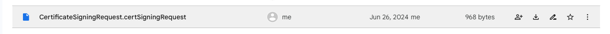
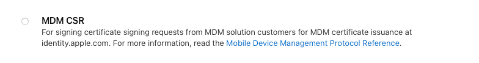
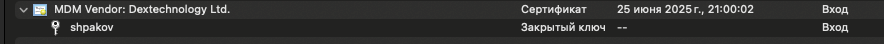
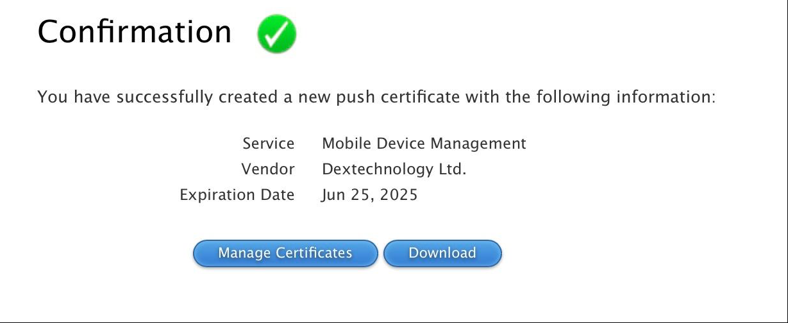
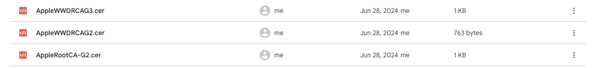

# IOS MDM

### Требования:

- Apple Configurator
- Swift 5.10 и выше
- Mac OS
- Включенный MDM CSR сертификат в Apple Developer Account
- Python 3 для 1-го этапа (создания необходимых сертификатов для получения MDM Push)
- OpenSSL command line

## Создание Apple MDM Push Certificate

1. Для начала необходимо сгенерировать запрос сертификата. Инструкция как это сделать [тут]("https://developer.apple.com/help/account/create-certificates/create-a-certificate-signing-request/:). Лучше всего генерировать все сертификаты одной подписью. Можно воспользоваться нашим из Google Drive:

2. Сгенерировать MDM CSR. Называться он скорее всего будет **mdm.cer**

3. Открыть **mdm.cer** в связке ключей. Правой кнопкой на закрытом ключе открытого сертификата (на примере "shpakov") и сохранить его как **private.p12**

4. Извлеките приватный ключ из нашего private.p12 ключа:

`openssl pkcs12 -in private.p12 -nocerts -out key.pem`

Если pkcs12 команды выбивают ошибку - можно попробовать добавить -legacy флаг в команду

Снимите пароль с закрытого ключа, используя следующую команду:

`openssl rsa -in key.pem out private.key`

Извлеките сертификат:

`openssl pkcs12 -in private.p12 -clcerts -nokeys -out cert.pem`

Переконвертируйте сертификат в DES:

`openssl x509 -in cert.pem -inform PEM -out mdm.cer -outform DES`

5. Дальше необходимо сгенерировать **applepush.csr** файл. Для этого скопируйте private.key, push.csr и mdm.cer в директорию Scripts/CreateApplePush и вызовите следующую команду: 

`python mdm_vendorpython mdm_vendor_sign.py –key private.key –csr push.csr –mdm mdm.cer –out applepush.csr`

В зависимости от настройки Питона может подойти команда `python3`

Полученный сертификат загружаем [сюда](https://identity.apple.com/pushcert/). Должен сгенерироваться APNS сертификат

6. Открываем его в связке ключей и скачиваем (уже сам сертификат) как mdm.p12

Если нажать правой кнопкой на сертификате и нажать "Свойства", то в поле "ID пользователя" можно найти строку типа "com.apple.mgmt.External...", которую мы будем в качетсво ID enroll профиля

7. Следующей командой переконвертируем его  PEM:

`openssl pkcs12 -in mdm.p12 -out PushCert.pem -nodes`

PushCert.pem и mdm.p12 перенесите в Resources/Certs

## Серверная часть

Для примера использовал сервер на Swift (Vapor). 

Переходим в директорию Scripts/CreateCerts и меняем в server.cnf везде значение subjectAltName на ваш IP wifi сети и запускаем скрипт:

`sh make_certs.sh`

Все необходимые файлы перенесутся в Resources/Certs директорию

После этого необходимо настроить .mobileConfig для подключения устройств к **MDM**

Необходимо открыть Apple Configurator. Открываем File/New Profile и в поле Identifier вводим ID пользователя из пункта **6.**

В столбце Certificates загружаем три сертификата apple из гугл диска (они open-source):

Далее загружаем из директории Resources/Certs файлы identity.p12 (не забыть указать пароль к нему), CA.crt и Server.crt. Итого должно быть 6 сертификатов

Остальные поля заполняем по своему желанию

После этого необходимо открыть полученный .mobileconfig (для удобства назовем его enroll.mobileconfig) файл в текстовом редакторе. Добавляем в словарь новое св-во dict (пример ниже). Это будет конфигурация нашего MDM сервера. К сожалению менять его возможно только руками в редакторе, так как Configurator такое не умеет:

    <dict>
        <key>AccessRights</key>
        <integer>4295</integer>
        <key>CheckInURL</key>
        <string>https://10.0.3.13:8080/checkin</string>
        <key>CheckOutWhenRemoved</key>
        <true/>
        <key>IdentityCertificateUUID</key>
        <string>3B697C82-84A9-4BE5-B829-8AB0953187B8</string>
        <key>PayloadIdentifier</key>
        <string>com.apple.mdm.3B697C82-84A9-4BE5-B829-8AB0953187B8</string>
        <key>PayloadType</key>
        <string>com.apple.mdm</string>
        <key>PayloadUUID</key>
        <string>96B11019-B54C-49DC-9480-43525834DE7B</string>
        <key>PayloadVersion</key>
        <integer>1</integer>
        <key>ServerCapabilities</key>
        <array>
            <string>com.apple.mdm.per-user-connections</string>
            <string>com.apple.mdm.bootstraptoken</string>
            <string>com.apple.mdm.token</string>
        </array>
        <key>ServerURL</key>
        <string>https://10.0.3.13:8080/action</string>
        <key>SignMessage</key>
        <true/>
        <key>Topic</key>
        <string>com.apple.mgmt.External.8aa6060a-d07b-483d-9509-6aaab021cb75</string>
        <key>UseDevelopmentAPNS</key>
        <false/>
    </dict>

### Значения таблицы: 

**AccessRights** - права, которые будет иметь MDM. [Оффициальная статья](https://developer.apple.com/documentation/devicemanagement/mdm). Разрешения представлены в виде битовых флагов. Для получения нескольких прав - значения нужно суммировать

**CheckInURL** - урл нашего MDM сервера, куда будут стучаться устройства при авторизации и разлогине. И не [только](https://developer.apple.com/documentation/devicemanagement/check-in)

**CheckOutWhenRemoved** - флаг, нужно ли говорить серверу если юзер сам удалит profile

**IdentityCertificateUUID** - в нашем enroll.mobileconfig файле найти PayloadIdentifier для p.12 ключа. Он будет иметь вид типа "com.apple.security.pkcs12.UUID". Необходимо вставить этот UUID в наше значение IdentityCertificateUUID

**PayloadIdentifier** - com.apple.mdm.НАШ IdentityCertificateUUID из поля выше

**PayloadType** - без изменений

**PayloadUUID** - любой UUID

**PayloadVersion** - без изменений

**ServerCapabilities** - пока без изменений

**ServerURL** - урл нашего MDM сервера, куда будут идти все остальные запросы от утсройства

**SignMessage** - без изменений. Если true - то устройство будут также присылать сигнатуру MDM сервера в заголовках. Для большей безопасности

**Topic** - Из пункта 6

**UseDevelopmentAPNS** - без изменений

Полученный файл можно уже отправлять пользователю. Он после сможем посмотреть и установить его. Но у него будет падать 400 ошибка, так как CheckInURL пока недоступен. 
